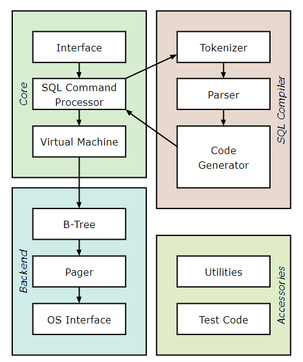

# SQLite与Berkeley DB

## SQLite(有效代码:数十万行左右)

* [SQLite数据库 简介、特点、优势、局限性及使用](https://www.cnblogs.com/l199616j/p/10694036.html)
* [SQLite教程](https://www.runoob.com/sqlite/sqlite-tutorial.html)
* [SQLite Download Page](https://www.sqlite.org/download.html)
* [如何学习sqlite源码？ - 知乎 (zhihu.com)](https://www.zhihu.com/question/22819578)
* [SQLite 源码探秘 01 - 起步 - 墨天轮 (modb.pro)](https://www.modb.pro/db/64641)
* [首页 | SQlite源码分析 (huili.github.io)](http://huili.github.io/index.html)
* [SQLite之SQL解析-词法分析-6 - 简书 (jianshu.com)](https://www.jianshu.com/p/baee54840756)

**SQLite**是一个进程内的轻量级嵌入式数据库，它的数据库就是一个文件，实现了自给自足、无服务器、零配置的、事务性的SQL数据库引擎。它是一个零配置的数据库，这就体现出来SQLite与其他数据库的最大的区别：SQLite不需要在系统中配置，直接可以使用。且SQLite不是一个独立的进程，可以按应用程序需求进行静态或动态连接。SQLite可直接访问其存储文件

## 系统结构

​	整体上，`Sqlite`可以分为前端，中端，后端三个部分，前端作为类似一个编译器的组件完成`Sql`命令的解析和处理，转换成中端的虚拟机可以执行的自定义字节码，前端又可以细分为词法分析器、语法分析器、代码生成三个子模块。虚拟机逐条执行生成的字节码，调用B-Tree的接口完成工作。

- **词法分析器**

执行一个包含SQL语句的字符串时，接口程序要把这个字符串传递给tokenizer。Tokenizer的任务是把原有字符串分割成一个个标识符（token），并把这些标识符传递给解析器。Tokenizer是用手工编写的，在C文件tokenize.c中。

- **语法分析器**

语法分析器的工作是在指定的上下文中赋予标识符具体的含义。SQLite的语法分析器使用Lemon LALR(1)分析程序生成器来产生，Lemon做的工作与YACC/BISON相同，但它使用不同的输入句法，这种句法更不易出错。Lemon还产生可重入的并且**线程安全**的语法分析器。Lemon定义了非终结析构器的概念，当遇到语法错误时它不会泄露内存。驱动Lemon的源文件可在parse.y中找到

- **代码生成器**

语法分析器在把标识符组装成完整的SQL语句后，就调用代码生成器产生虚拟机代码，以执行SQL语句请求的工作。

- **虚拟机**

代码生成器生成的代码由虚拟机来执行。总的来说，虚拟机实现一个专为操作数据库文件而设计的抽象计算引擎

- **B-Tree**

SQLite 数据库使用 B 树实现在磁盘上维护 在[btree.c](https://sqlite.org/src/file/src/btree.c)源文件中找到。单独的 B 树用于 数据库中的每个表和每个索引。所有 B 树都存储在 相同的磁盘文件。[文件格式](https://www.sqlite.org/fileformat2.html)详细信息稳定且定义明确，并且 保证向前兼容。与 B 树子系统和 SQLite 库其余部分的接口 由头文件[btree.h](https://sqlite.org/src/file/src/btree.h) 定义。

- **页面高速缓存**

B树模块以固定大小的数据块形式从磁盘上请求信息，默认的块大小是1024个字节，但是可以在512和65536个字节之间变化。页面高速缓存负责读、写和缓存这些数据块。页面高速缓存还提供回滚和原子提交的抽象，并且管理数据文件的锁定。B树驱动模块从页面高速缓存中请求特定的页，当它想修改页面、想提交或回滚当前修改时，它也会通知页面高速缓存。页面高速缓存处理所有麻烦的细节，以确保请求能够快速、安全而有效地被处理。

- **OS接口**

为了在POSIX和Win32操作系统之间提供移植性，SQLite使用一个抽象层来提供操作系统接口

