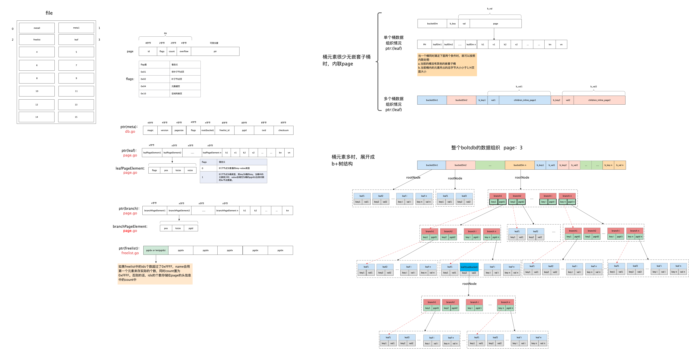
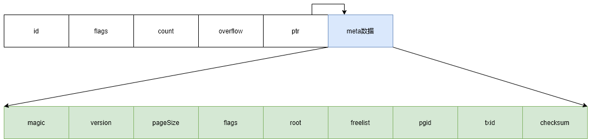
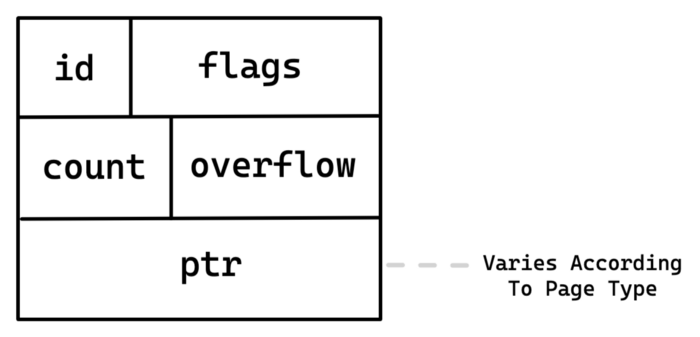
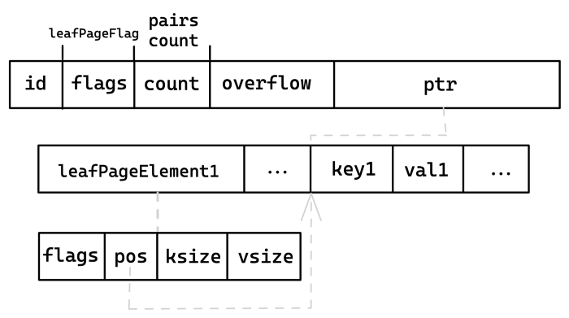
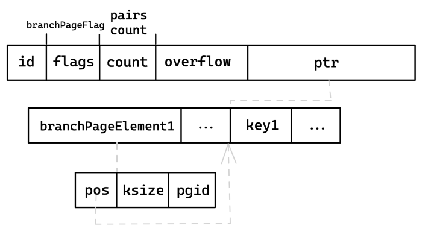

# Jammdb数据库

参考的数据库：`BoltDB` `LMDB`

## BoltDB

顶级对象: `DB`, 代表一个打开的文件。

事务：

Bucket(存储桶): key-value的集合 

从bucket中获取key-value, 当key not null,value is null, 存在sub-bucket



## JammDB分析

### ptr.rs

```rust
#[derive(Clone)]
pub struct Ptr<T>(pub(crate) *const T);
```

这个文件主要是对裸指针的一个封装。避免在代码中使用大量的`unsafe`代码块。

### data.rs

```rust
/// A wrapper around data to ensure it is used before a bucket goes out of scope
pub struct Ref<'a, T> {
    inner: T,
    _phantom: PhantomData<&'a ()>,
}
```

`Ref`主要是对数据的封装，并实现了一些`trait`。

```rust
#[derive(Clone, Debug, PartialEq)]
pub enum Data {
    /// Contains data about a nested bucket
    Bucket(BucketData),
    /// a key / value pair of bytes
    KeyValue(KVPair),
}
```

`Data`描述了获取数据时的数据结构，数据分为两种类型，一种是sub_bucket，在数据库中bucket可以嵌套。另一种是key-value数据。

```rust
#[derive(Clone, Debug, PartialEq)]
pub struct BucketData {
    name: SliceParts,
    meta: SliceParts,
}
```

`BucketData`描述了此数据是嵌套bucket.

```rust
#[derive(Clone, Debug, PartialEq)]
pub struct KVPair {
    key: SliceParts,
    value: SliceParts,
}
```

```rust
#[derive(Clone, Copy)]
pub(crate) struct SliceParts {
    ptr: *const u8,
    len: u64,
}
```

`SliceParts`数据结构是对内存中数据的封装。

### db.rs

作为对外提供的顶层对象，代表了打开的数据库/文件。

```rust
pub struct OpenOptions {
    pagesize: u64,
    num_pages: usize,
}
```

`OpenOptions` 为获取和设置页面大小服务。数据库使用本机的页面大小，但在迁移数据库时可能会遇到不同页大小的系统，因此需要根据当前系统设置请求的页大小。

```rust
fn init_file(path: &Path, pagesize: u64, num_pages: usize) -> Result<File>
```

打开数据库时，第一次文件不存在，需要进行初始化工作，设置数据库的元数据。数据库按照页来组织数据，每个页的起始位置存储元数据。页的结构如下[page](#page)

数据库使用0-1两个页存储元数据信息，第2页存储空闲链表，第3页作为叶子页面存储`BucketMeta`

```rust
pub struct DB(Arc<DBInner>);
pub(crate) struct DBInner {
    pub(crate) data: Arc<Mmap>,
    pub(crate) freelist: Freelist,

    pub(crate) file: Mutex<File>,
    pub(crate) mmap_lock: Mutex<()>,
    pub(crate) open_ro_txs: Mutex<Vec<u64>>,

    pub(crate) pagesize: u64,
}
```

打开数据库后，会对文件加锁，因此其它进程不能再打开此数据库，同时将文件映射到内存中，初始化空闲页面链表。数据库的页面组织形式如下:




### page.rs

<span id="page"> </span>

```rust
pub(crate) struct Page {
    pub(crate) id: PageID,
    pub(crate) page_type: PageType,
    // count在不同类型页面代表不同的含义
    pub(crate) count: u64,
    pub(crate) overflow: u64,
    pub(crate) ptr: u64,
}


```




`Page`数据结构定义了页面起始位置的元数据，包括其ID，类型等。其类型包含四种，分别是

```rust
TYPE_BRANCH 分支页面
TYPE_LEAF	叶子页面
TYPE_META	元数据页面
TYPE_FREELIST	空闲页面链表页面
```

其`ptr`字段在数据库的两个元数据页面中是`Meta`数据结构的起始地址[meta](#meta)

在空闲页面链表页面中是空闲页面ID数组的起始位置

在叶子页面中是叶子元素的数组起始位置

```rust
#[repr(C)]
pub(crate) struct LeafElement {
    // 是否是bucket
    pub(crate) node_type: NodeType,
    // key/value相对于leafPageElement的偏移量
    pos: u64,
    key_size: u64,
    value_size: u64,
}
```




在分支页面中是分支元素的数组起始位置

```rust

#[repr(C)]
pub(crate) struct BranchElement {
    // 该条branchPageElement数据所指向的children page id.
    pub(crate) page: PageID,
    // key的长度
    key_size: u64,
    // key相对于本branchPageElement对象在内存中的偏移量
    pos: u64,
}
```

分支页面中数据只包含key。




```rust
pub(crate) fn write_node(&mut self, n: &Node, num_pages: u64) -> Result<()> 
```

`write_node`函数将一个`node` 转换为页面数据写入页面，`Node`是`Page`在内存中的一个视图。


### meta.rs

<span id="meta"> </span>

```rust
pub(crate) struct Meta {
    // 元数据页面编号
    pub(crate) meta_page: u8,
    // 自定义魔数
    pub(crate) magic: u32,
    // 版本号
    pub(crate) version: u32,
    // 页大小
    pub(crate) pagesize: u32,
    // 根bucket
    pub(crate) root: BucketMeta,
    // 当前已分配的最大page id
    pub(crate) num_pages: PageID,
    // 管理空闲页面的页面id
    pub(crate) freelist_page: PageID,
    // 当前metaData关联的事务id
    pub(crate) tx_id: u64,
    // 校验和
    pub(crate) hash: [u8; 32],
}
```

元数据的结构定义，这些元数据嵌入在页面前部。在建立数据库时，前两个页用来存放元信息。


### freelist.rs

```rust
#[derive(Clone)]
pub(crate) struct Freelist {
    // 按照id进行排序了
    free_pages: BTreeSet<PageID>,
    pending_pages: BTreeMap<u64, Vec<PageID>>,
}
```

管理空闲页面的数据结构，在打开数据库时，会根据存储的空闲链表页面构建`Freelist`。

```rust
// adds the page to the transaction's set of free pages
pub(crate) fn free(&mut self, tx_id: u64, page_id: PageID) {
    let pages = self.pending_pages.entry(tx_id).or_insert_with(Vec::new);
    pages.push(page_id);
}
```

空闲页面结构维护一个`pending_pages`，当一个事务释放一个页面后，会在等待队列里插入，每个事务都有自己的等待队列。

```rust
// frees all pages from old transactions that have lower ids than the given tx_id
pub(crate) fn release(&mut self, tx_id: u64) {
    let pending_ids: Vec<u64> = self.pending_pages.keys().cloned().collect();
    for other_tx_id in pending_ids {
        if other_tx_id < tx_id {
            let pages = self.pending_pages.remove(&other_tx_id).unwrap();
            pages.into_iter().for_each(|p| {
                self.free_pages.insert(p);
            });
        } else {
            break;
        }
    }
}
```

`release` 函数尝试将位于等待队列且所在队列对应的事务id小于给定id的页面全部释放掉，并插入到`free_pages`列表中。

```rust
pub(crate) fn allocate(&mut self, num_pages: usize) -> Option<PageID>
```

`allocate`函数 首先尝试在`free_pages`中分配空闲页面。


### node.rs

```rust
pub(crate) struct Node {
    // 
    pub(crate) id: NodeID,
    // 该node对应的page id 
    pub(crate) page_id: PageID,
    // page的overflow字段+1 ，即这个节点占用的页
    pub(crate) num_pages: u64,
    // 当前节点所属的直系bucket
    bucket: Ptr<BucketInner>,
    // 对于叶子节点，其没有children字段
    pub(crate) children: Vec<NodeID>,
    // 从data可以区分节点属于叶子/非叶子
    pub(crate) data: NodeData,
    // 是否已经写入磁盘
    pub(crate) deleted: bool,
    // data中最小的key
    original_key: Option<SliceParts>,
}

pub(crate) enum NodeData {
    // 分支节点
    Branches(Vec<Branch>),
    // 叶子节点
    Leaves(Vec<Data>),
}
pub(crate) struct Branch {
    key: SliceParts,
    pub(crate) page: PageID,
}
```

`Node` 数据结构是`page`在内存中的映像。

```rust
impl NodeData {
     fn split_at(&mut self, index: usize) -> NodeData {
        match self {
            NodeData::Branches(b) => NodeData::Branches(b.split_off(index)),
            NodeData::Leaves(l) => NodeData::Leaves(l.split_off(index)),
        }
    }

    fn merge(&mut self, other_data: &mut Self) {
        match (self, other_data) {
            (NodeData::Branches(b1), NodeData::Branches(b2)) => {
                b1.append(b2);
                b1.sort_unstable_by_key(|b| b.key);
            }
            (NodeData::Leaves(l1), NodeData::Leaves(l2)) => {
                l1.append(l2);
                l1.sort_unstable_by_key(|l| l.key_parts());
            }
            _ => panic!("incompatible data types"),
        }
    }
}
```

`split_at` 和 `merge` 分别用于节点的合并与拆分。

```rust
pub(crate) struct Branch {
    key: SliceParts,
    pub(crate) page: PageID,
}
```

```rust
impl Node{
    pub(crate) fn from_page(id: NodeID, b: Ptr<BucketInner>, p: &Page) -> Node 
    pub(crate) fn insert_data(&mut self, data: Data)
    pub(crate) fn insert_child(&mut self, id: NodeID, key: SliceParts)
    pub(crate) fn delete(&mut self, index: usize) -> Data 
    pub(crate) fn write(&mut self, file: &mut File) -> Result<()> 
}
```

`from_page` 函数用于从`page`构建 `Node`。

- 判断page类型
- 如果是Branch，则获取key-pageid数据
- 如果是leaf，则获取key-value/key-bucket数据


`insert_data` 函数用于插入数据，当前节点如果是非叶子节点则不可插入。

`insert_child`函数用于插入子节点，只能是非叶子节点可以插入子节点。

`delete` 函数用于从叶子节点中删除数据。

`write` 函数将节点的数据刷新到磁盘上。

```rust
impl Node{
    pub(crate) fn split(&mut self) -> Option<Vec<Branch>> 
    pub(crate) fn merge(&mut self) -> bool 
}
```

在节点上增添/删除数据导致页面的填充度过大或者过小，需要对节点进行平衡操作。

**分裂:** 当一个node中的数据过多时，最简单就是当超过了page的填充度时，就需要将当前的node拆分成两个，也就是底层会将一页数据拆分存放到两页中。

**合并:** 当删除了一个或者一批对象时，此时可能会导致一页数据的填充度过低，此时空间可能会浪费比较多。所以就需要考虑对页之间进行数据合并。


### bucket.rs

```rust
pub struct Bucket {
    inner: RefCell<BucketInner>,
}
pub(crate) struct BucketInner {
    // 关联的事务
    pub(crate) tx: Ptr<TransactionInner>,
    // 元数据，包含根page id，下一个bucket id
    pub(crate) meta: BucketMeta,
    // 当前bucket对应的B+树根节点
    pub(crate) root: PageNodeID,
    dirty: bool,
    // 缓存当前Bucket下的子Bucket
    buckets: HashMap<Vec<u8>, Pin<Box<Bucket>>>,
    // 缓存Bucket中B+树的节点
    nodes: Vec<Pin<Box<Node>>>,
    // 
    page_node_ids: HashMap<PageID, NodeID>,
    //
    page_parents: HashMap<PageID, PageID>,
}
```

`Bucket`类似于关系型数据库中的表，区别在于`Bucket`支持嵌套，一个`Bucket`中可以包含很多子`Bucket`。而不管是父`Bucket`还是子`Bucket`，每个`Bucket`都唯一对应一个B+树，B+树中存储着该`Bucket`的所有数据和`children Bucket`.

所有的操作都会根据`bucket`来进行:

```rust
pub fn put<T: AsRef<[u8]>, S: AsRef<[u8]>>(
        &self,
        key: T,
        value: S,
    ) -> Result<Option<Ref<KVPair>>>
pub fn cursor(&self) -> Cursor {
    Cursor::new(Ptr::new(&self.inner.borrow()))
}
pub fn get_bucket<T: AsRef<[u8]>>(&self, name: T) -> Result<BucketRef>
pub fn delete<T: AsRef<[u8]>>(&self, key: T) -> Result<Ref<KVPair>> {
    Ok(Ref::new(self.inner.borrow_mut().delete(key)?))
}
pub fn create_bucket<T: AsRef<[u8]>>(&self, name: T) -> Result<BucketRef> 
pub fn get_or_create_bucket<T: AsRef<[u8]>>(&self, name: T) -> Result<BucketRef>
pub fn delete_bucket<T: AsRef<[u8]>>(&self, name: T) -> Result<()>
pub fn next_int(&self) -> u64
pub(crate) fn rebalance(&mut self) -> Result<BucketMeta> 
pub(crate) fn write(&mut self, file: &mut File) -> Result<()>

// 下面的这些函数通过cursor完成工作
pub fn get<T: AsRef<[u8]>>(&self, key: T) -> Option<Ref<Data>> 
pub fn get_kv<T: AsRef<[u8]>>(&self, key: T) -> Option<Ref<KVPair>> 
pub fn sub_buckets(&self) -> impl Iterator<Item = (Ref<BucketData>, BucketRef)>
pub fn kv_pairs(&self) -> impl Iterator<Item = Ref<KVPair>>
```

出除了通过`cursor`完成工作的几个函数外，其它的功能需要其它函数协助完成。


### cursor.rs

```rust
pub struct Cursor<'a> {
    // bucket的引用
    bucket: Ptr<BucketInner>,
    // 栈式遍历
    stack: Vec<Elem>,
    next_called: bool,
    _phantom: PhantomData<&'a ()>,
}
struct Elem {
    // 当前页面中的索引
    index: usize,
    // 可能是内存中的node/磁盘上的page
    page_node: PageNode,
}

#[derive(Clone, Copy)]
pub(crate) enum PageNodeID {
    Page(PageID),
    Node(NodeID),
}
// 游标遍历时会从位于内存中的node节点读取数据/从磁盘读取page数据
pub(crate) enum PageNode {
    Page(Ptr<Page>),
    Node(Ptr<Node>),
}
```

每个`Cursor`与一个`bucket`实例绑定，用户可以使用cursor遍历一个bucket中的数据。

### transaction.rs

`jammdb` 支持**读写事务**、**只读事务**。同一时间有且只能有一个读写事务执行；但同一个时间可以允许有多个只读事务执行。 每个事务都拥有自己的一套一致性视图。

```rust
pub struct Transaction<'a> {
    inner: RefCell<Pin<Box<TransactionInner>>>,
    // 写事务会获取文件锁
    file: Option<MutexGuard<'a, File>>,
}
pub(crate) struct TransactionInner {
    pub(crate) db: Ptr<DBInner>,
    pub(crate) meta: Meta,
    // 是否可写
    pub(crate) writable: bool,
    pub(crate) freelist: Freelist,
    // 内存映射的数据
    data: Arc<Mmap>,
    root: Option<Bucket>,
    buffers: Vec<Vec<u8>>,
}
```


## 参考文章

[key-value数据库bbolt深入分析：Bucket & Freelist - 墨天轮 (modb.pro)](https://www.modb.pro/db/209792)

[Boltdb学习笔记之二--数据结构 - 后端技术小屋 (backendhouse.github.io)](https://backendhouse.github.io/post/boltdb学习笔记之二-数据结构/)

[Databases Behind the Scenes: How BoltDB Saves Data To the Disk | ITNEXT](https://itnext.io/databases-behind-the-scenes-how-boltdb-saves-data-to-the-disk-de8f1e3feda6)

[简介 · GitBook (jaydenwen123.github.io)](https://jaydenwen123.github.io/boltdb/)

[深入浅出boltdb —— 0x04 事务 - 叉鸽 MrCroxx 的博客](http://blog.mrcroxx.com/posts/code-reading/boltdb-made-simple/4-transaction/)